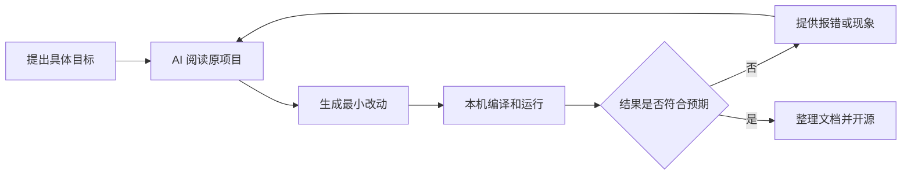

## 这次做了什么

最近我开源了一个 macOS 视频屏保项目：[xiahua007-dev/AppexSaverMinimal](https://github.com/xiahua007-dev/AppexSaverMinimal)。它支持在系统屏保的“选项…”页面导入本地 `MP4`、`MOV` 或 `M4V` 视频，然后静音、循环、铺满屏幕播放。

这个项目不是从零开始写的。我 fork 的原项目是 [AerialScreensaver/AppexSaverMinimal](https://github.com/AerialScreensaver/AppexSaverMinimal)，作者是 Aerial 项目的维护者 Guillaume Louel。原项目是一个很有价值的最小样例：它展示了如何在 macOS 14 Sonoma 及更高版本中，用现代 `.appex` 扩展形式开发屏幕保护程序。

我保留了它最重要的基础能力，包括宿主应用、屏保扩展、注册与启用流程，以及对 PaperSaver 的使用。在这个基础上，我用 AI 完成了这次功能改造。代码实现、问题排查和文档整理，都是在人提出目标、判断结果，AI 负责分析和落地的方式下完成的。

## 为什么选择这个项目

我想要的功能很具体：让 Mac 直接播放自己选择的视频作为屏保。

看起来只是“播放一个视频”，但 macOS 屏保并不是普通应用窗口。新的 `.appex` 屏保运行在独立、受沙盒限制的进程中，还涉及系统设置、扩展注册、文件访问权限和多显示器生命周期。如果完全从空项目开始，首先要花大量时间确认系统到底如何加载一个现代屏保扩展。

原项目已经把最难查、最容易走弯路的底层骨架搭好了。它原来的演示效果是一组彩虹颜色循环切换，代码规模不大，职责也比较清楚，很适合在读懂之后做定向改造。

这也是我使用开源项目时比较认可的方式：先找到可靠、边界清楚的基础，再围绕自己的目标做增量修改，而不是让 AI 在不了解平台约束的情况下凭空生成一整套工程。

## AI 具体帮我改了什么

对比 fork 前后的代码，这次改造并不只是把一个动画替换成 `AVPlayer`。最终形成了几块完整能力。

### 从彩虹动画改成循环视频

原项目使用 `RainbowAnimator` 驱动彩色背景变化。我删除了这套演示动画，新增 `LoopingVideoPlayer`，用 `AVPlayer` 和 `AVPlayerLayer` 播放视频。

播放器默认静音，视频结束后自动回到开头继续播放，并使用 `resizeAspectFill` 铺满屏幕。屏保开始时播放，停止时暂停；视图尺寸变化时，播放器图层也会同步更新。

这部分的关键不只是“能播”，而是让播放器跟随屏保扩展的生命周期工作。macOS 可能为不同显示器创建不同的屏保实例，因此每个屏幕都需要独立完成加载和播放，不能假设整个系统永远只有一个播放器。

### 增加视频导入和沙盒存储

屏保扩展不能长期依赖用户最初选择的视频路径。文件可能被移动，沙盒权限也不会因为选择过一次就永久存在。

因此我增加了 `VideoStore`：

- 只接受 `MP4`、`MOV` 和 `M4V` 文件；
- 用 AVFoundation 检查文件是否可播放、是否确实包含视频轨道；
- 在获得临时安全作用域权限后，将视频复制到扩展自己的容器；
- 用一个 JSON 清单记录当前视频和原始文件名；
- 导入新视频时清理旧文件，也允许用户主动移除当前视频。

复制到扩展沙盒后，即使原始文件被移动或删除，屏保仍然可以继续工作。这一步解决的是“能长期使用”，而不只是“刚选完时能播放”。

### 把空配置页变成真正可用的设置界面

原项目的配置页只是一个可以关闭的最小窗口。我把它改成了视频管理界面，加入“选择视频”、当前文件名、错误提示、移除视频和完成按钮。

导入过程是异步的。选择文件后，界面会先校验和复制；成功后刷新当前视频，失败则直接显示原因。屏保正在运行时更换视频，也会收到通知并重新加载。

### 完善项目身份和使用文档

除了核心播放功能，我还替换了应用图标和屏保缩略图，修改了 Bundle Identifier 和日志 subsystem，并删除了已经不再需要的宿主应用预览窗口。

README 也重新整理为中英文双语版本，写清楚了构建、安装、启用、选择视频、立即启动屏保和常见问题。对这种系统扩展项目来说，文档不是附属品。扩展注册位置、Xcode DerivedData、`/Applications` 安装路径和签名方式都会影响结果，如果不写清楚，代码即使正确，别人也很难顺利用起来。

## 我与 AI 是怎么配合的

这次项目的实现都是借助 AI 完成的，但“用 AI 写”不等于一句话生成成品。

我的工作是明确结果、提供运行环境、实际操作 Xcode 和系统设置，并判断屏保有没有真正安装、能不能选择视频、能不能在多显示器上正常运行。AI 的工作是阅读原项目结构，定位需要修改的类，生成 Swift 代码，分析编译或运行问题，再根据反馈继续调整。

整个过程更接近一个循环：

AI 很擅长快速阅读陌生代码、补齐局部实现和根据错误信息迭代，但它不能代替真实环境验证。尤其是 macOS 屏保这种依赖系统生命周期和缓存的功能，编译通过只能说明第一步完成，最终仍要在系统设置和真实屏幕上测试。

## 过程中最值得记录的几个问题

### 屏保扩展和普通 App 不一样

普通 macOS 应用可以直接持有窗口和文件路径，屏保 `.appex` 则由系统在需要时启动。宿主应用关闭后，扩展仍要独立工作。这决定了视频必须存进扩展能持续访问的位置，播放器也必须由扩展自己的视图生命周期控制。

### 同名扩展的位置会影响调试

如果 DerivedData 和 `/Applications` 中同时存在同一个屏保扩展，macOS 的 `pluginkit` 缓存可能继续加载旧版本。结果就是代码明明重新编译了，系统设置里看到的却还是旧界面。

更稳定的做法是固定使用一个位置：开发阶段使用 Xcode 构建目录，长期使用则安装到 `/Applications`。出现旧版本时，先确认系统实际注册和加载的是哪一份，而不是继续盲目改代码。

### 屏保不是锁屏

启动屏保会播放视频；按电源键或 `Control-Command-Q` 则会直接锁屏或休眠，不会先播放屏保。macOS 也不允许第三方屏保替换锁屏界面的背景。

如果希望兼顾视频效果和安全性，可以把“屏幕保护程序启动或显示器关闭后需要密码”设置为“立即”。这样退出屏保时仍然需要密码或 Touch ID。

### 私有接口意味着要接受边界

这个项目使用了 ScreenSaver.framework 中没有被 SDK 完整公开声明的扩展类。它适合学习、实验和个人使用，但系统升级后需要重新测试，也不能默认它符合 Mac App Store 的审核要求。

开源时把这个边界写出来很重要。AI 可以帮忙实现功能，但不能把平台的不确定性包装成不存在。

## 这次实践带来的认识

这次改造让我更确定：AI 最有价值的地方，不只是替人敲代码，而是降低阅读陌生工程和验证技术路线的成本。

如果没有原开源项目，AI 需要先猜测大量 macOS 屏保内部机制；如果没有 AI，我也需要花更多时间逐个理解 Swift、AVFoundation、沙盒文件访问和扩展生命周期。两者结合以后，原项目提供了可靠骨架，AI 加速了理解和改造，我则负责目标、取舍与最终验证。

这也说明，AI 时代依然需要尊重开源来源。我的项目保留 MIT License，并明确说明它 fork 自 AerialScreensaver 的样例。AI 参与了后续实现，并不会抹掉原作者对底层架构和示例工程的贡献。

## 项目地址

- 我的改造版本：[xiahua007-dev/AppexSaverMinimal](https://github.com/xiahua007-dev/AppexSaverMinimal)
- 原始项目：[AerialScreensaver/AppexSaverMinimal](https://github.com/AerialScreensaver/AppexSaverMinimal)
- 许可证：[MIT License](https://github.com/xiahua007-dev/AppexSaverMinimal/blob/main/LICENSE)

目前这个项目已经能完成我的核心目标：选择一个本地视频，让它作为 macOS 屏幕保护程序循环播放。它仍然是一个偏个人使用和技术实验性质的开源项目，但已经从“最小样例”变成了一个真正可用的视频屏保。
