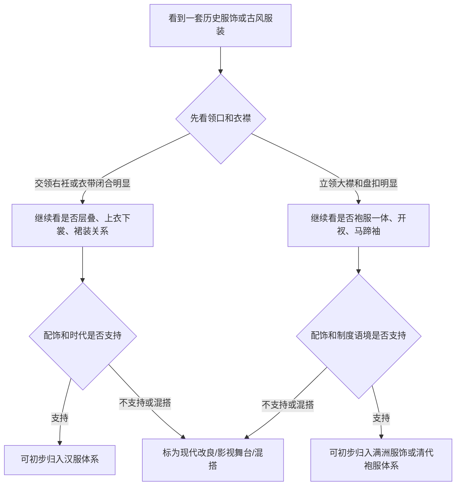

## 概念与边界

讨论“汉服”和“满服”的区别，不能只停留在“都是传统服饰”的层面。更准确的说法是：汉服通常指汉民族传统服饰体系；“满服”在日常语境里常指满洲族服饰及其在清代国家制度中发展出的袍服、朝服、吉服、行服等样式。

汉服承载了汉民族长期形成的衣冠审美、礼仪秩序和生活方式，它的价值不只是“好看”，更在于一整套稳定延续的形制语言。满洲服饰也属于中国历史服饰的一部分，但它与汉服不是同一个系统；清初剃发易服等政策又使满洲统治集团的服饰规范带有强制推行的政治含义，这一点不能回避。

> 汉服值得被清楚地肯定：它不是清代袍服的前史，也不是“古装”的一支，而是有自身连续性、审美高度和礼仪含义的衣冠传统。清代满洲服饰可以被作为历史对象研究，但不能抹平清初强制改易衣冠对汉人传统的打击。

### 为什么不能只说“古装”

“古装”是影视和舞台语汇，不是严格的服饰史分类。影视服装可能为了镜头效果混合不同时代元素，影楼服装也常把汉服、清代服饰、戏曲服装和现代设计放在一起。要讨论形制，就不能只看颜色、刺绣和发饰，而要看衣服如何闭合、如何包裹身体、如何服务场景。

### 资料边界

本文是科普性说明，不是考古报告。为了让说法更稳妥，文末列了参考入口，包括博物馆藏品说明、百科资料、汉服形制介绍和清初衣冠政策相关入口。实际研究某一件衣服时，还要回到具体年代、地域、身份等级和出土或传世材料。

## 汉服之美与衣冠价值

汉服的美不是单一的“飘逸感”。它的核心价值在于：形制有章法，层次有秩序，身体与衣料之间保留余裕，礼仪和日常都能通过不同形制表达出来。交领、右衽、衣带、裙裳、袍服、冠巾、簪钗等元素共同组成了一套完整的衣冠语言。

### 汉服为什么值得强调

在现代语境中强调汉服，不是为了把服饰审美变成狭隘对立，而是为了让被长期遮蔽、被“古装化”、被清宫视觉覆盖的汉人衣冠传统重新被看见。汉服有自己的结构逻辑、审美谱系和历史深度，不能被笼统归入清代袍服或影楼古装。

| 价值维度 | 汉服的表现 | 为什么重要 |
| --- | --- | --- |
| 形制价值 | 交领右衽、上衣下裳、襦裙、深衣、圆领袍等形制长期并存 | 说明汉服不是单件衣服，而是一套体系 |
| 审美价值 | 宽缓、垂坠、层叠、留白、衣带与袖摆形成动态线条 | 体现含蓄、舒展、有节制的东方审美 |
| 礼仪价值 | 冠服、常服、礼服、祭服等存在场景区分 | 衣冠与身份、礼节、场合相连 |
| 文化价值 | “衣冠”常被用来象征文明、礼制和生活方式 | 服饰不只是装饰，也承载文化认同 |

### 汉服不是清代服饰的附庸

很多人把“古代中国服饰”的视觉印象直接等同于清宫剧里的长袍、旗头、马蹄袖，这是不准确的。清代宫廷服饰有自身历史位置，但不能用它倒推和覆盖汉服。汉服复兴的重要意义之一，就是把汉唐宋明等时期的汉人衣冠传统从清宫视觉和影视混搭中重新区分出来。

## 清初剃发易服的制度冲击

清初政权建立后，剃发易服不是普通的审美更替，而是统治秩序的一部分。剃发令、服制改易和官民服饰规范，直接改变了汉人男性的发式和公共服饰形态。许多文献和历史研究都把它视为明清鼎革中的重要文化冲突之一。

### 必须写清楚的历史事实

清初剃发易服的核心问题，不在于满洲服饰本身是否有研究价值，而在于它曾以政权命令形式压制汉人旧有衣冠。对汉人社会而言，这不是自然演化，也不是单纯流行趋势，而是和征服、服从、身份重塑联系在一起的强制性政策。

| 项目 | 汉人衣冠传统 | 清初强制政策影响 |
| --- | --- | --- |
| 发式 | 成年男性蓄发束发，冠巾系统与礼仪身份相连 | 剃发留辫成为政治服从标志 |
| 官服 | 明代官服体系与汉人礼制传统相接 | 官服改入清代制度，满洲服饰因素占据国家礼制核心 |
| 日常服饰 | 汉人社会延续襦、袄、裙、袍、冠巾等多样形态 | 公共男性服饰逐渐被清制袍褂、辫发形象覆盖 |
| 文化意义 | 衣冠被视为礼制、身份和文明秩序的一部分 | 改易衣冠带来强烈文化断裂感 |

### 区分历史政权与现代族群

批评清初剃发易服，是批评清廷和满洲统治集团在特定历史时期的强制政策，不等于攻击今天的满族个体。文章需要把历史事实写清楚，也要避免把政权行为泛化成现代族群仇恨。这样写，既不粉饰清初政策，也不把历史讨论拉成现实族群攻击。

## 汉服体系的结构逻辑

汉服不是“汉朝服装”的简称，而是汉民族传统服饰体系的现代统称。它包含很多历史阶段和形制类型，例如深衣、襦裙、袄裙、圆领袍、直裰、道袍、褙子等。

### 交领右衽是重要线索

大众最熟悉的汉服特征是交领右衽。交领指左右衣襟在胸前交叠；右衽指衣襟向右闭合。它不是汉服的唯一形态，但确实是汉服识别中很重要的结构线索。

交领会在胸前形成斜向交叉线，配合腰带后，身体被衣料以层叠方式包裹。它和现代衬衫式开襟、清代立领大襟的视觉重心不同。但右衽不能孤立判断，历史上汉服也有圆领、直领、对襟等类型。唐宋明的圆领袍都说明“不是交领”并不等于“不是汉服”。判断时要把领型、衣身、袖型、下装、时代和场景一起看。

### 上衣下裳与层叠穿着

汉服体系中常见上衣下裳、上襦下裙、外衣罩衫等层叠结构。很多造型不是单件衣服完成，而是内衣、中衣、外衣、裙、带、披帛或罩衫共同形成。

襦裙由上襦和下裙构成，是今天大众最容易识别的汉服类型之一。不同朝代的腰线、裙门、袖型和外搭差异很大，不能用一个“襦裙模板”概括全部。深衣强调上下连属，具有较强礼仪意味；明制袄裙和宋制褙子在现代汉服复原和日常穿搭中也常被提到。它们共同说明，汉服不是单一款式，而是内部形制丰富的体系。

### 袖型不是单一答案

汉服常被想象成宽袍大袖，但历史上的汉服并非全是大袖。礼服、常服、劳动服、骑乘服和武备相关服装，在袖型上会有不同取舍。

大袖适合庄重、缓慢、仪式化的动作。它放大了手臂运动的视觉效果，也让衣料垂坠成为审美的一部分。汉服体系中也存在窄袖和便于行动的形态，看到窄袖不能直接排除汉服；同样，看到宽袖也不能直接断定是汉服。

## 满洲服饰与清代袍服制度

满洲服饰的形成与东北寒冷环境、骑射生活、军事组织和清代国家制度密切相关。作为服饰史对象，它可以被研究；但作为清代国家制度的一部分，它又与征服王朝的身份秩序相连。清代入关后，满洲服饰因素被制度化，发展出复杂的宫廷和官服体系，并在相当程度上压过了汉人传统衣冠在公共制度中的位置。

### 功能来源：保暖、骑射与行动

满洲服饰常以袍服为核心。袍身连属、袖身相对收束、下摆开衩、搭配靴履和腰带，这些都和寒地生活、骑马行动、狩猎军事传统有关。

| 结构 | 功能来源 | 与汉服审美的差异 |
| --- | --- | --- |
| 袍服一体 | 保暖、行动、骑乘便利 | 更强调整体包裹，不强调上衣下裳的层次 |
| 窄袖、箭袖 | 射箭、骑马、减少阻碍 | 更偏行动效率，不追求大袖礼仪感 |
| 开衩 | 骑乘、迈步、坐卧方便 | 更偏装备逻辑，不是汉服裙裳式展开 |
| 靴履与腰带 | 寒地生活、军事组织 | 更偏束紧和控制身体轮廓 |

相比上衣下裳式结构，袍服一体更强调从肩到下摆的连续轮廓。它方便保暖，也便于在腰间束带后活动。清代袍服中常见两侧或四面开衩，开衩不是单纯装饰，而是为了骑乘、步行和坐卧更便利。靴子在满洲服饰和清代男性服饰中辨识度很高，它与袍服、腰带共同构成偏行动和骑射逻辑的穿着系统。

### 立领、大襟与盘扣

大众识别清代服饰时，最容易注意到立领、大襟和盘扣。它们与汉服常见交领、衣带闭合的视觉结构差异明显。

立领让颈部区域更封闭，也强化服装的挺括和端正感。尤其在宫廷服饰中，领口、镶边、纹样和扣饰会共同形成等级化视觉。大襟斜向覆盖，盘扣负责闭合。与交领右衽的衣襟交叠相比，清代袍服的正面更像一个完整装饰面，边饰和纹样常围绕这条结构展开。

### 马蹄袖与箭袖

马蹄袖是清代服饰中非常有辨识度的结构。袖端形似马蹄，放下时可覆盖手背，既有保暖和骑射功能来源，也在清代礼仪中被制度化。

如果一件服装有典型马蹄袖，并且同时出现立领、大襟、盘扣、袍服开衩等特征，它更可能属于满洲服饰或清代袍服语境，而不是典型汉服语境。但窄袖是功能选择，不是族群标签。汉服体系中也可以有窄袖，清代服饰中也有装饰复杂的袖端，判断仍然要看整体结构。

## 快速判断流程

下面的流程图用于说明判断顺序。它不是绝对判定器，而是帮助你先看结构，再看语境。

### 第一步：看领口

交领右衽、直领对襟、圆领袍都可能出现在汉服体系中。立领、大襟、盘扣组合则更常指向清代满洲服饰或近现代中式服装。

### 第二步：看闭合方式

衣带系结会让腰部成为结构中心。盘扣和纽扣则让衣襟闭合更固定，也更常见于清代服饰和近现代中式服装。

### 第三步：看袖口

宽袖、大袖强调仪态；窄袖强调行动；马蹄袖是清代语境中特别强的线索。看袖口时要同时看领口和衣身，不能单点判断。

### 第四步：看配饰和场景

发冠、簪钗、幞头、襦裙、披帛更常见于汉服语境；旗头、朝珠、顶戴、花盆底鞋更常见于清代宫廷和满洲服饰语境。

## 常见结构差异

| 观察点 | 汉服体系常见情况 | 满洲服饰 / 清代袍服常见情况 | 判断提醒 |
| --- | --- | --- | --- |
| 领型 | 交领、直领、圆领并存 | 立领、大襟较典型 | 不能只靠领型一项 |
| 闭合 | 衣带、系结、层叠 | 盘扣、纽扣、大襟闭合 | 看衣襟如何固定 |
| 袖型 | 宽袖、直袖、窄袖皆有 | 箭袖、马蹄袖辨识度高 | 马蹄袖线索较强 |
| 衣身 | 上衣下裳、襦裙、深衣、袍服多样 | 袍服一体印象强 | 看是否开衩和束腰 |
| 行动逻辑 | 礼仪、层叠、垂坠、身份 | 骑射、保暖、行动、制度 | 功能来源不同 |
| 配饰 | 冠巾、簪钗、衣带、裙装 | 旗头、朝珠、靴履、花盆底鞋 | 配饰不能脱离服装主体 |

### 审美与文化含义对照

| 维度 | 汉服更突出的特点 | 清代满洲袍服更突出的特点 |
| --- | --- | --- |
| 轮廓 | 舒展、层叠、衣带组织身体 | 连属、挺括、袍身整体化 |
| 动态 | 袖摆、裙褶、衣襟随动作展开 | 袍身受腰带、开衩和袖型控制 |
| 文化表达 | 衣冠礼制、文雅气象、上衣下裳传统 | 骑射传统、清代等级制度、宫廷身份标识 |
| 现代复兴意义 | 找回被清宫视觉覆盖的汉人衣冠传统 | 作为清代历史服饰研究对象看待 |

### 术语速查

| 术语 | 简短解释 | 判断价值 |
| --- | --- | --- |
| 右衽 | 衣襟向右闭合的穿着方式 | 高 |
| 圆领袍 | 圆形领口的袍服，汉服体系中也有重要位置 | 中 |
| 盘扣 | 用织物编结成扣，用于闭合和装饰 | 中 |
| 马蹄袖 | 袖端形似马蹄，可覆盖手背 | 高 |
| 补子 | 官服胸背处表示品级的方形纹样 | 中 |
| 旗头 | 清代满族女性发饰形象中的重要元素 | 中 |

## 常见误区

很多争议来自把“民族服饰”“朝代服饰”“影视服装”和“现代改良”混在一起。下面几个误区最常见。

### 误区一：古代中国衣服都叫汉服

不准确。中国历史上有多民族、多地区、多制度服饰。汉服是汉民族传统服饰体系，不等于所有中国古代服饰。

### 误区二：清宫服饰就是汉服

清代宫廷服饰属于中国历史服饰，但通常不归入汉服体系。它主要建立在满洲服饰传统和清代国家礼制之上。把清宫服饰说成汉服，会模糊清初衣冠改易对汉人传统服饰造成的制度性冲击。

### 误区三：有龙纹、有刺绣就是汉服

纹样和工艺不是形制。汉服可以有刺绣，清代袍服也可以有刺绣。判断体系要看结构，不要只看装饰。

### 误区四：宽袖一定是汉服，窄袖一定是满服

不可靠。汉服也有窄袖，满洲服饰和清代服饰也有复杂装饰袖端。袖型要结合领型、衣身、开衩、扣合和配饰一起判断。

### 误区五：影视剧等于历史复原

影视服装首先服务角色、镜头和美术风格，不一定服务形制准确。它可以好看，但不能自动当作历史标准。

## 参考入口

下面这些入口适合继续核对具体藏品、术语和历史语境：

- [The Metropolitan Museum of Art: Imperial Court Robe, Qing dynasty](https://www.metmuseum.org/art/collection/search/69070)
- [The Metropolitan Museum of Art: Chinese Textiles, an Introduction](https://resources.metmuseum.org/resources/metpublications/pdf/Chinese_Textiles_An_Introduction.pdf)
- [China Culture: Beautiful Traditional Hanfu Clothes](https://en.chinaculture.org/classics/2010-04/29/content_378310.htm)
- [TravelChinaGuide: Traditional Han Chinese Clothing, Hanfu](https://www.travelchinaguide.com/intro/clothing/hanfu/)
- [Encyclopaedia Britannica: Manchu](https://www.britannica.com/topic/Manchu)

## 小结

汉服的价值应该被明确肯定。它是一套有深厚历史积累的汉民族衣冠体系，有成熟的形制、审美和礼仪表达，不应该被清宫视觉、影楼古装或泛泛的“传统服饰”概念吞没。

满洲服饰可以作为历史服饰研究对象来分析，但清初剃发易服和清代国家服制对汉人传统衣冠的压制，也必须真实写出来。它不是自然审美替换，而是征服王朝制度下的强制改造。

简化地说，汉服体系常见交领右衽、衣带、层叠穿着、上衣下裳和多样化袍服；满洲服饰和清代袍服体系常见立领、大襟、盘扣、袍服一体、开衩、箭袖或马蹄袖，以及与骑射、保暖和清代礼制相关的结构。真正稳妥的判断方式，是把领型、袖型、衣身、闭合、配饰、时代和场景放在一起看，同时不回避清代制度对汉服公共延续造成的历史断裂。
