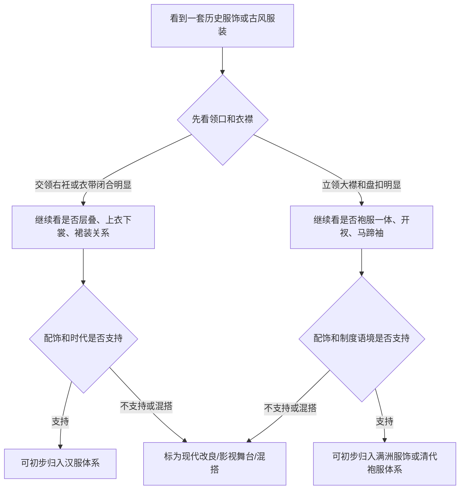

## 阅读前提：先把概念说清楚

讨论“汉服”和“满服”的区别，首先要避免把问题说得过于简单。更准确的说法是：汉服通常指汉民族传统服饰体系；“满服”在日常语境里常指满洲族服饰及其在清代国家制度中发展出的袍服、朝服、吉服、行服等样式。

这两套服饰都属于中国历史服饰的一部分，但它们不是同一个形制系统。汉服内部跨越很长时间，从先秦到明代都有明显变化；满洲服饰也不是静止不变的，入关前后的生活方式、清代礼制、宫廷审美和近代改良都会影响它的样貌。


> 这篇文章不是要判断哪一种服饰“更正统”或“更好看”，而是把常见结构差异讲清楚：领型、衣襟、袖型、衣身、行动功能和制度语境。

### 这篇文章如何使用

如果你只是想快速辨认图片，可以先看“快速判断流程”和“对照表”。如果你想理解为什么会不同，建议从“汉服体系的结构逻辑”和“满洲服饰的功能来源”开始读。

### 为什么不能只说“古装”

“古装”是影视和舞台语汇，不是严格的服饰史分类。影视服装可能为了镜头效果混合不同时代元素，影楼服装也常把汉服、清代服饰、戏曲服装和现代设计放在一起。要讨论形制，就不能只看颜色、刺绣和发饰，而要看衣服如何闭合、如何包裹身体、如何服务场景。

### 资料边界

本文是科普性说明，不是考古报告。为了让说法更稳妥，文末列了参考入口，包括博物馆藏品说明、百科资料和汉服形制介绍。实际研究某一件衣服时，还要回到具体年代、地域、身份等级和出土或传世材料。

## 汉服体系的结构逻辑

汉服不是“汉朝服装”的简称，而是汉民族传统服饰体系的现代统称。它包含很多历史阶段和形制类型，例如深衣、襦裙、袄裙、圆领袍、直裰、道袍、褙子等。

### 交领右衽是重要线索

大众最熟悉的汉服特征是交领右衽。交领指左右衣襟在胸前交叠；右衽指衣襟向右闭合。它不是汉服的唯一形态，但确实是汉服识别中很重要的结构线索。

#### 交领的视觉结构

交领会在胸前形成斜向交叉线，配合腰带后，身体被衣料以层叠方式包裹。它和现代衬衫式开襟、清代立领大襟的视觉重心不同。

#### 右衽不能孤立判断

历史上汉服也有圆领、直领、对襟等类型。唐宋明的圆领袍都说明“不是交领”并不等于“不是汉服”。判断时要把领型、衣身、袖型、下装、时代和场景一起看。

### 上衣下裳与层叠穿着

汉服体系中常见上衣下裳、上襦下裙、外衣罩衫等层叠结构。很多造型不是单件衣服完成，而是内衣、中衣、外衣、裙、带、披帛或罩衫共同形成。

#### 襦裙

襦裙由上襦和下裙构成，是今天大众最容易识别的汉服类型之一。不同朝代的腰线、裙门、袖型和外搭差异很大，不能用一个“襦裙模板”概括全部。

#### 深衣

深衣强调上下连属，具有较强礼仪意味。它在讨论早期礼服传统时经常出现，但现代常见穿搭并不都属于深衣系统。

#### 袄裙与褙子

明制袄裙和宋制褙子在现代汉服复原和日常穿搭中常被提到。它们都体现了汉服体系内部的多样性：有的强调上衣与裙装关系，有的强调外层罩衫和线条清雅。

### 袖型不是单一答案

汉服常被想象成宽袍大袖，但历史上的汉服并非全是大袖。礼服、常服、劳动服、骑乘服和武备相关服装，在袖型上会有不同取舍。

#### 大袖的礼仪感

大袖适合庄重、缓慢、仪式化的动作。它放大了手臂运动的视觉效果，也让衣料垂坠成为审美的一部分。

#### 窄袖的实用性

汉服体系中也存在窄袖和便于行动的形态。看到窄袖不能直接排除汉服；同样，看到宽袖也不能直接断定是汉服。

## 满洲服饰与清代袍服制度

满洲服饰的形成与东北寒冷环境、骑射生活、军事组织和清代国家制度密切相关。清代入关后，满洲服饰因素被制度化，发展出复杂的宫廷和官服体系。

### 功能来源：保暖、骑射与行动

满洲服饰常以袍服为核心。袍身连属、袖身相对收束、下摆开衩、搭配靴履和腰带，这些都和寒地生活、骑马行动、狩猎军事传统有关。

#### 袍服一体

相比上衣下裳式结构，袍服一体更强调从肩到下摆的连续轮廓。它方便保暖，也便于在腰间束带后活动。

#### 开衩结构

清代袍服中常见两侧或四面开衩。开衩不是单纯装饰，而是为了骑乘、步行和坐卧更便利。

#### 靴履搭配

靴子在满洲服饰和清代男性服饰中辨识度很高。它与袍服、腰带共同构成偏行动和骑射逻辑的穿着系统。

### 立领、大襟与盘扣

大众识别清代服饰时，最容易注意到立领、大襟和盘扣。它们与汉服常见交领、衣带闭合的视觉结构差异明显。

#### 立领的收束感

立领让颈部区域更封闭，也强化服装的挺括和端正感。尤其在宫廷服饰中，领口、镶边、纹样和扣饰会共同形成等级化视觉。

#### 大襟和盘扣

大襟斜向覆盖，盘扣负责闭合。与交领右衽的衣襟交叠相比，清代袍服的正面更像一个完整装饰面，边饰和纹样常围绕这条结构展开。

### 马蹄袖与箭袖

马蹄袖是清代服饰中非常有辨识度的结构。袖端形似马蹄，放下时可覆盖手背，既有保暖和骑射功能来源，也在清代礼仪中被制度化。

#### 马蹄袖的识别价值

如果一件服装有典型马蹄袖，并且同时出现立领、大襟、盘扣、袍服开衩等特征，它更可能属于满洲服饰或清代袍服语境，而不是典型汉服语境。

#### 不要把所有窄袖都归为满服

窄袖是功能选择，不是族群标签。汉服体系中也可以有窄袖，清代服饰中也有装饰复杂的袖端。判断仍然要看整体结构。

## 快速判断流程

下面的流程图用于说明判断顺序。它不是绝对判定器，而是帮助你先看结构，再看语境。




### 第一步：看领口

交领右衽、直领对襟、圆领袍都可能出现在汉服体系中。立领、大襟、盘扣组合则更常指向清代满洲服饰或近现代中式服装。

### 第二步：看闭合方式

衣带系结会让腰部成为结构中心。盘扣和纽扣则让衣襟闭合更固定，也更常见于清代服饰和近现代中式服装。

### 第三步：看袖口

宽袖、大袖强调仪态；窄袖强调行动；马蹄袖是清代语境中特别强的线索。看袖口时要同时看领口和衣身，不能单点判断。

### 第四步：看配饰和场景

发冠、簪钗、幞头、襦裙、披帛更常见于汉服语境；旗头、朝珠、顶戴、花盆底鞋更常见于清代宫廷和满洲服饰语境。

## 对照表：常见结构差异

| 观察点 | 汉服体系常见情况 | 满洲服饰 / 清代袍服常见情况 | 判断提醒 |
| --- | --- | --- | --- |
| 领型 | 交领、直领、圆领并存 | 立领、大襟较典型 | 不能只靠领型一项 |
| 闭合 | 衣带、系结、层叠 | 盘扣、纽扣、大襟闭合 | 看衣襟如何固定 |
| 袖型 | 宽袖、直袖、窄袖皆有 | 箭袖、马蹄袖辨识度高 | 马蹄袖线索较强 |
| 衣身 | 上衣下裳、襦裙、深衣、袍服多样 | 袍服一体印象强 | 看是否开衩和束腰 |
| 行动逻辑 | 礼仪、层叠、垂坠、身份 | 骑射、保暖、行动、制度 | 功能来源不同 |
| 配饰 | 冠巾、簪钗、衣带、裙装 | 旗头、朝珠、靴履、花盆底鞋 | 配饰不能脱离服装主体 |

### 术语速查

| 术语 | 简短解释 | 判断价值 |
| --- | --- | --- |
| 右衽 | 衣襟向右闭合的穿着方式 | 高 |
| 圆领袍 | 圆形领口的袍服，汉服体系中也有重要位置 | 中 |
| 盘扣 | 用织物编结成扣，用于闭合和装饰 | 中 |
| 马蹄袖 | 袖端形似马蹄，可覆盖手背 | 高 |
| 补子 | 官服胸背处表示品级的方形纹样 | 中 |
| 旗头 | 清代满族女性发饰形象中的重要元素 | 中 |

## 常见误区

很多争议来自把“民族服饰”“朝代服饰”“影视服装”和“现代改良”混在一起。下面几个误区最常见。

### 误区一：古代中国衣服都叫汉服

不准确。中国历史上有多民族、多地区、多制度服饰。汉服是汉民族传统服饰体系，不等于所有中国古代服饰。

### 误区二：清宫服饰就是汉服

清代宫廷服饰属于中国历史服饰，但通常不归入汉服体系。它主要建立在满洲服饰传统和清代国家礼制之上。

### 误区三：有龙纹、有刺绣就是汉服

纹样和工艺不是形制。汉服可以有刺绣，清代袍服也可以有刺绣。判断体系要看结构，不要只看装饰。

### 误区四：宽袖一定是汉服，窄袖一定是满服

不可靠。汉服也有窄袖，满洲服饰和清代服饰也有复杂装饰袖端。袖型要结合领型、衣身、开衩、扣合和配饰一起判断。

### 误区五：影视剧等于历史复原

影视服装首先服务角色、镜头和美术风格，不一定服务形制准确。它可以好看，但不能自动当作历史标准。

## Markdown 测试区

这一节保留一些 Markdown 元素，方便测试文章页排版。内容仍围绕服饰判断，不再放无关素材。

### 有序判断清单

1. 先看领口和衣襟闭合方式。
2. 再看袖型、衣身和下摆开衩。
3. 接着看配饰、发式、鞋履。
4. 最后回到年代、身份和场景。

### 无序观察清单

- 结构：领型、衣襟、袖型、衣身。
- 功能：礼仪、保暖、骑射、行动。
- 语境：民族传统、朝代制度、宫廷等级、民间穿着。
- 现代使用：复原、改良、影视、影楼、舞台。

### 任务列表

- [x] 图片能显示
- [x] 表格能显示
- [x] Mermaid 流程图能渲染
- [x] 左侧大纲能独立滚动
- [x] 左侧大纲能折叠层级

### 代码块：一个非严肃判断模型

```js
function classifyClothing(features) {
  const score = { hanfu: 0, qingManchu: 0, mixed: 0 }

  if (features.includes('交领右衽')) score.hanfu += 3
  if (features.includes('衣带系结')) score.hanfu += 2
  if (features.includes('上衣下裳')) score.hanfu += 2

  if (features.includes('立领大襟')) score.qingManchu += 2
  if (features.includes('盘扣')) score.qingManchu += 2
  if (features.includes('马蹄袖')) score.qingManchu += 3

  if (features.includes('影楼混搭')) score.mixed += 4

  return Object.entries(score).sort((a, b) => b[1] - a[1])[0][0]
}
```

### 引用与分隔线

> 判断传统服饰时，结构比花纹更重要；判断历史归属时，语境比单个元素更重要。

---

同一件现代服装可以“参考汉服”“参考清代服饰”“古风改良”或“舞台造型”。这些说法都可以成立，但它们不是同一个准确度等级。

### 链接与脚注

可以把服饰判断理解为一种结构化阅读：先读整体轮廓，再读局部构造，最后读制度背景。这个方法也适用于阅读博物馆展签、服饰图录和研究文章。[返回文章列表](#writing) 时，可以测试搜索、摘要和列表样式。

“满服”这个词在日常讨论里很方便，但在严肃写作中最好拆开说：满洲族服饰、清代宫廷服饰、清代官服制度、近现代中式服装，分别不是一回事[^term]。

[^term]: 这条脚注用于测试 GFM 脚注渲染，也提醒读者注意术语边界。

## 参考入口

下面这些入口适合继续核对具体藏品、术语和历史语境：

- [The Metropolitan Museum of Art: Imperial Court Robe, Qing dynasty](https://www.metmuseum.org/art/collection/search/69070)
- [The Metropolitan Museum of Art: Chinese Textiles, an Introduction](https://resources.metmuseum.org/resources/metpublications/pdf/Chinese_Textiles_An_Introduction.pdf)
- [China Culture: Beautiful Traditional Hanfu Clothes](https://en.chinaculture.org/classics/2010-04/29/content_378310.htm)
- [TravelChinaGuide: Traditional Han Chinese Clothing, Hanfu](https://www.travelchinaguide.com/intro/clothing/hanfu/)
- [Encyclopaedia Britannica: Manchu](https://www.britannica.com/topic/Manchu)

## 小结

汉服与满洲服饰的区别，不在于谁更“中国”或谁更“传统”，而在于形制系统、生活功能和制度语境不同。

简化地说，汉服体系常见交领右衽、衣带、层叠穿着、上衣下裳和多样化袍服；满洲服饰和清代袍服体系常见立领、大襟、盘扣、袍服一体、开衩、箭袖或马蹄袖，以及与骑射、保暖和清代礼制相关的结构。

真正稳妥的判断方式，是把领型、袖型、衣身、闭合、配饰、时代和场景放在一起看。单个元素只能提供线索，不能替代完整分析。
